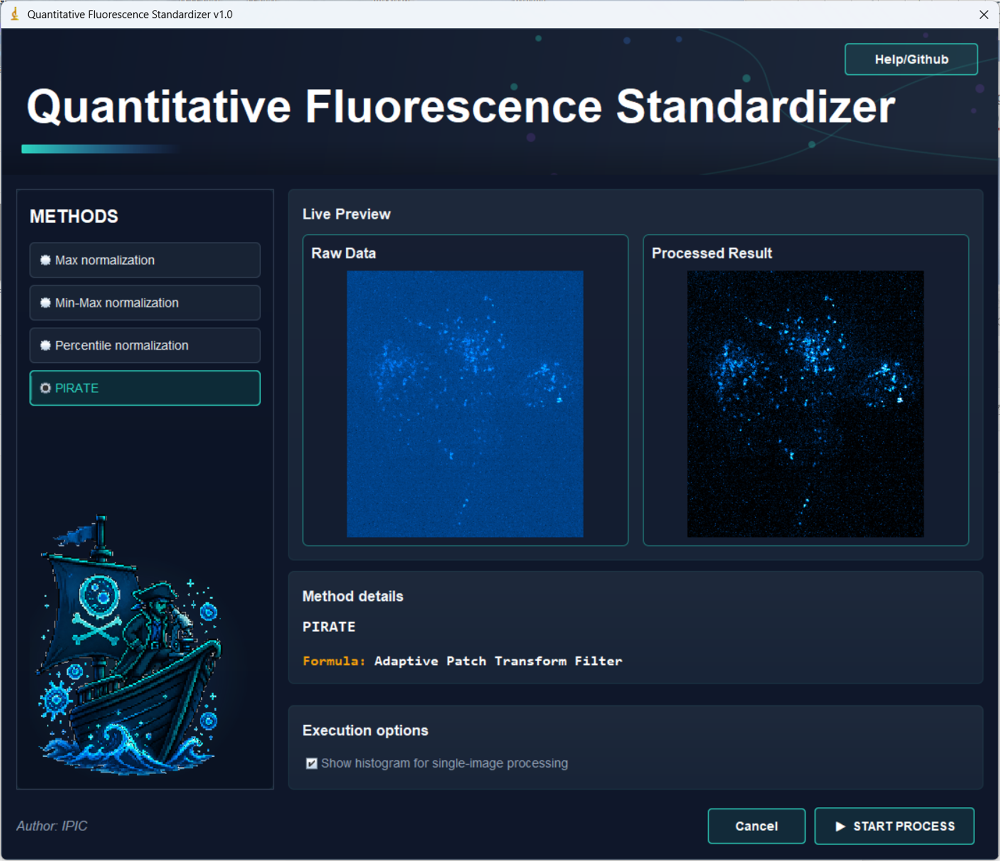

# PIRATE

PIRATE is an ImageJ/Fiji plugin for quantitative fluorescence intensity standardization in biological fluorescence imaging. It provides an easy-to-use graphical interface for intensity normalization of single images and image stacks, supporting Max, Min-Max, Percentile, and PIRATE normalization workflows.

PIRATE is designed to improve the consistency and comparability of fluorescence intensity distributions across images, especially in workflows where intensity variation, background fluctuation, or photon-limited acquisition conditions affect downstream visualization and quantitative analysis.

## Preview

### Graphical User Interface



### Example Output

| Raw image | PIRATE output |
| --- | --- |
|  |  |

## Features

- ImageJ/Fiji plugin with a Swing-based graphical user interface.
- PIRATE adaptive patch-based fluorescence intensity normalization.
- Baseline normalization modes, including:
  - Max normalization
  - Min-Max normalization
  - Percentile normalization
- Support for 8-bit, 16-bit, and 32-bit grayscale images.
- Support for both single images and image stacks.
- Histogram visualization for single-image normalization.
- Stack processing using normalization parameters estimated from the first slice.
- Bundled PIRATE logo asset for the plugin interface.

## Installation

### Option 1: Use the bundled JAR

1. Copy `pirate_1.0.0.jar` into the `plugins/` folder of Fiji or ImageJ.
2. Restart Fiji/ImageJ.
3. Open an image.
4. Run the plugin from:

```text
Plugins > PIRATE > PIRATE
```

### Option 2: Download a release JAR

1. Download `pirate_1.0.0.jar` from the GitHub Releases page.
2. Copy the JAR file into the `plugins/` folder of Fiji or ImageJ.
3. Restart Fiji/ImageJ.
4. Open an image and run:

```text
Plugins > PIRATE > PIRATE
```

### Option 3: Build from source

Requirements:

- Java 8 or later
- Maven 3.x
- Fiji or ImageJ

Build the project with:

```bash
mvn clean package
```

After building, the plugin JAR will be generated under:

```text
target/pirate_1.0.0.jar
```

Copy this JAR file into the Fiji/ImageJ `plugins/` folder, then restart Fiji/ImageJ.

## Usage

1. Open an 8-bit, 16-bit, or 32-bit grayscale image or image stack in Fiji/ImageJ.
2. Run:

```text
Plugins > PIRATE > PIRATE
```

3. Select a normalization mode:
   - `PIRATE`: adaptive patch-based fluorescence intensity normalization.
   - `Percentile normalization`: normalization based on user-defined lower and upper percentiles.
   - `Min-Max normalization`: normalization based on the occupied intensity range.
   - `Max normalization`: normalization by the maximum occupied intensity.
4. Choose whether to display the histogram.
5. Click `START PROCESS`.

For image stacks, PIRATE estimates normalization parameters from the first slice and applies the resulting normalization model to all slices in the stack.

## Normalization Modes

### PIRATE normalization

The PIRATE mode performs adaptive patch-based fluorescence intensity normalization. It is designed for biological fluorescence images where local intensity distributions may vary because of uneven illumination, background fluctuation, photon-limited acquisition, or sample-dependent signal heterogeneity.

### Percentile normalization

Percentile normalization rescales image intensity using user-defined lower and upper percentile thresholds. This mode is useful when extreme intensity values should be excluded from the normalization range.

### Min-Max normalization

Min-Max normalization rescales the occupied intensity range of the image to the output dynamic range.

### Max normalization

Max normalization rescales image intensity according to the maximum occupied intensity value.

## Repository Layout

```text
.
|-- pirate_1.0.0.jar
|-- pom.xml
|-- src/main/java/org/srwiki/pirate/PIRATE_Normalization.java
|-- src/main/resources/plugins.config
|-- src/main/resources/pirate_logo_3x4_transparent.png
|-- src/main/resources/1.png
`-- examples/
    |-- GUI.png
    |-- RAW.png
    `-- PIRATE_output.png
```
